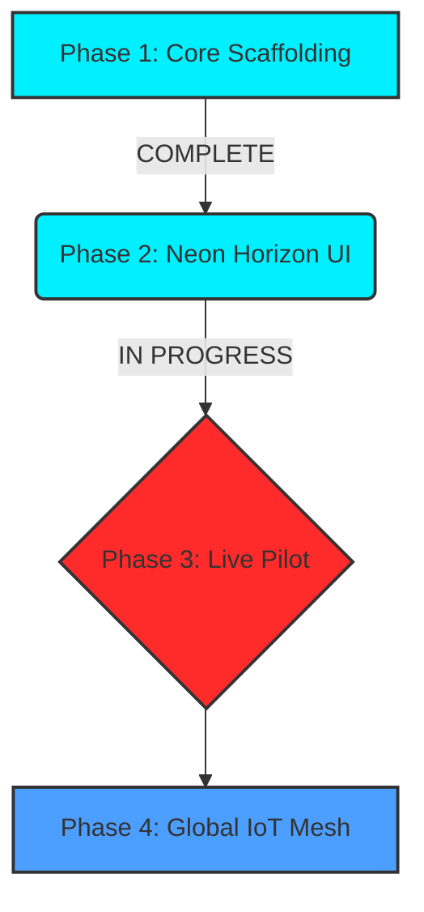

<div align="center">
  

  # 🦾 AI SUPPLY CHAIN: NEON HORIZON
  ### *The Future of Autonomous Logistics & Predictive Intelligence*

  <p align="center">
    
    
    
    
  </p>

  ---

  **A mission-critical AI platform designed to eliminate supply chain uncertainty for modern enterprises.**
  *Precision. Automation. Evolution.*

</div>

<br />

## 🛠️ THE CORE STACK
<div align="center">
  <table>
    <tr>
      <td align="center"><b>Frontend</b></td>
      <td align="center"><b>Backend</b></td>
      <td align="center"><b>Intelligence</b></td>
      <td align="center"><b>Infrastructure</b></td>
    </tr>
    <tr>
      <td></td>
      <td></td>
      <td></td>
      <td></td>
    </tr>
    <tr>
      <td></td>
      <td></td>
      <td></td>
      <td></td>
    </tr>
  </table>
</div>

<br />

## ⚡ SYSTEM CAPABILITIES
◈ **Deep Demand Intelligence**: Multi-variate forecasting using seasonal & event-driven signals.  
◈ **Quantum Route Optimization**: Solving complex VRP (Vehicle Routing Problems) in real-time.  
◈ **Autonomous Inventory**: Self-healing stock levels based on predictive consumption.  
◈ **Risk Neural Network**: Proactive supplier behavior monitoring and disruption alerting.  

<br />

## 📦 NEEDED THINGS (PREREQUISITES)
Before initializing the **Neon Horizon** protocols, ensure the following are deployed:

### 🖥️ Hardware Requisites
- **CPU**: 4+ Cores (ARM64/x86_64)
- **RAM**: 8GB Minimum (16GB Recommended for ML Training)

### ⚙️ Software Dependencies
| Tool | Version | Purpose |
| :--- | :--- | :--- |
| **Python** | `3.9+` | AI/ML Core & FastAPI Backend |
| **Node.js** | `16.x+` | React Dashboard Environment |
| **PostgreSQL** | `13+` | Primary Data Persistence |
| **Redis** | `6.x+` | High-speed Caching & State |
| **Docker** | `Latest` | (Optional) Containerized Deployment |

### 🔑 Security & API Tokens
- `MAPBOX_ACCESS_TOKEN` / `GOOGLE_MAPS_API_KEY` (Required for Globe Visualizer)
- `AWS_ACCESS_KEY` (For SageMaker/Vertex AI integration)

<br />

## 🚀 DEPLOYMENT PROTOCOL
```bash
# 1. CLONE THE REPO
git clone https://github.com/Zavmedia/AI-in-Supply-Chain-Management.git

# 2. IGNITE THE BACKEND
cd backend
pip install -r requirements.txt
python -m uvicorn src.main:app --port 8000 --reload

# 3. LAUNCH THE FRONTEND
cd ../frontend
npm install
npm run start
```

<br />

## 🧬 EVOLUTION ROADMAP


<br />

---

<div align="center">
  
  <p><b>EMPOWER YOUR OPERATIONS. FUTURE-PROOF YOUR LOGISTICS.</b></p>
  <i>Crafted with passion by Zavmedia. © 2026</i>
</div>
